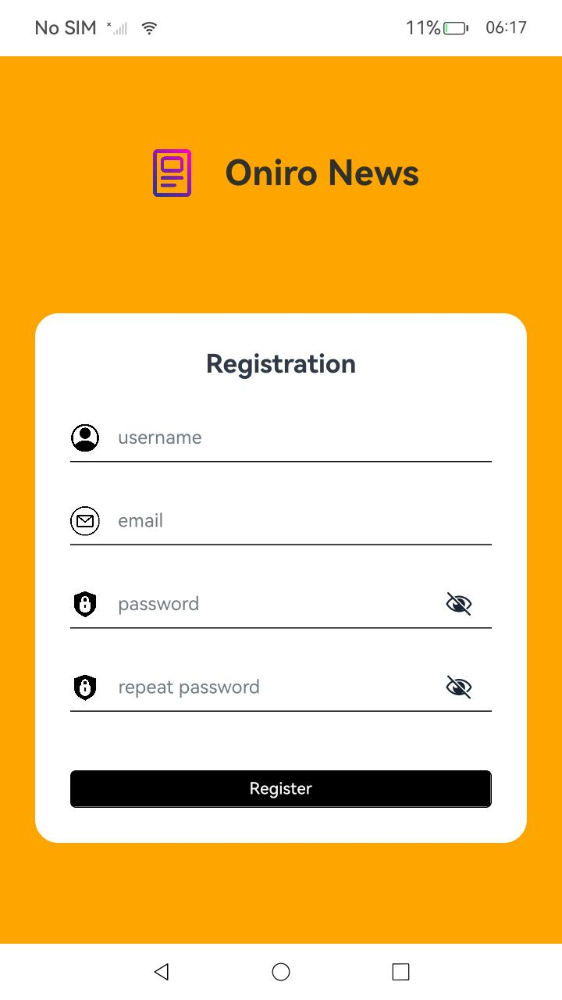
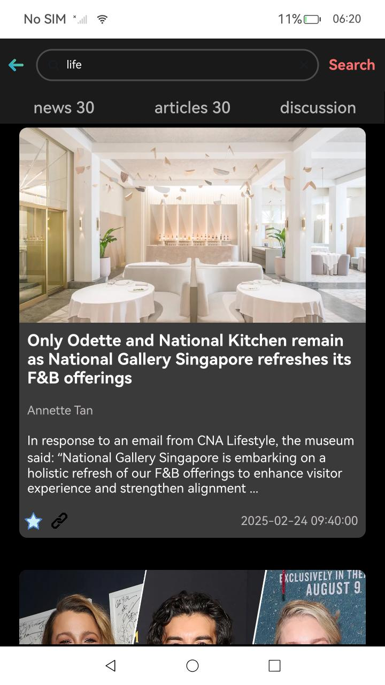
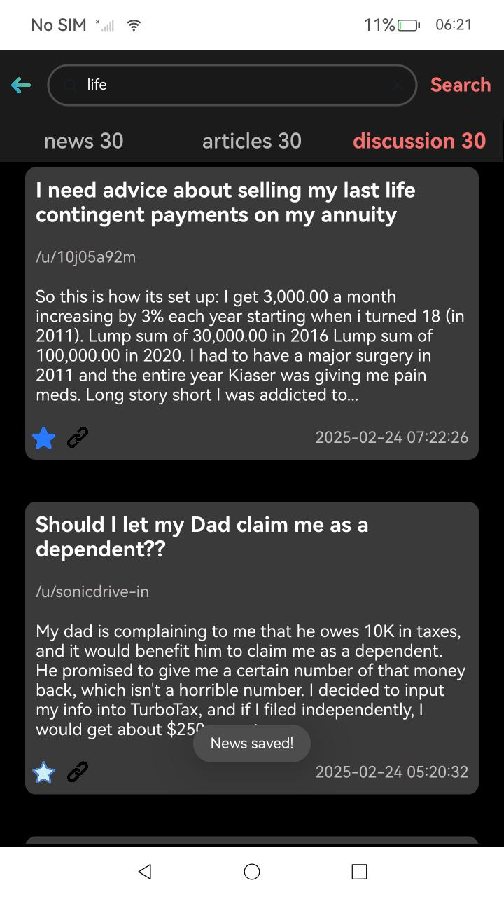

# app-OniroNews

### Content table
1. [Description](#description)  
2. [Main Features](#main-features)  
3. [API Resource](#api-resource)  
4. [MVVM Architecture](#mvvm-architecture)
4. [Customized Preference Setting](#customized-preference-setting)  
5. [Class Diagram](#class-diagram)
6. [Project Structure](#project-structure)
### Description
Oniro News is a personalized news app where users can browse and collect their favorite news content.  
The app supports user login and registration, also displays collected news according to user preferences.  

### Main Features
- **Login & Registration**  
User can login and register account for the application with vaild format.  

  
  

- **Preferred browsering mode**  
User can choose day mode or night mode for the application.  

  
  

- **Search**  
User can search news by typing keyword, and choose the information category format: "news", "articles" or "discussion".  

  

- **Save news**  
User can save their favorite news into starlist.  

  
  

### API Resource
- **Currents API**  
(https://currentsapi.services/en/docs/)

#### Base URLs
- `https://api.currentsapi.services`

#### Endpoints  
The encapuslated `DataSource` class provides methods to search news, get latest news and get news categories.

##### 1. Get Latest News
**URL Template:**  
`https://api.currentsapi.services/v1/latest-news?language=${language}&apiKey=${key}`  
**Method Signature:**  
`async getLatestNews(language: string, category?: string): Promise<NewsResponse>`  
**Description:**  
Get latest news information by replacing {language} and {key}, apikey should be given when registering the `CurrentAPI` account.
**Parameters:**  
- `language(string):` Default set to `en`, available languages can be found through endpoint: `https://api.currentsapi.services/v1/available/languages`  
- `category(string):`Available categories can be found through endpoint:`https://api.currentsapi.services/v1/available/categories`  
**Return:**  
Return results is a promise that resolves a list of maximum 30 amount of recent news from all over the world.

##### 2. Search News
**URL Template:**  
`https://api.currentsapi.services/v1/search?language=${language}&keywords=${keywords}&type=${type}&apiKey=${key}`  
**Method Signature:**  
`async searchNews(language: string, keywords: string, type: number, page_number?: number): Promise<NewsResponse>`  
**Description:**  
Search news according to give keyword, apikey should be given when registering the `CurrentAPI` account.
**Parameters:**  
- `language(string):` Default set to `en`, available languages can be found through endpoint: `https://api.currentsapi.services/v1/available/languages`  
- `type(string):` Filter results by content type, valid values: `1(news)`, `2(articles)`, `3(discussion content)`.  
- `keywords(string):` Keyword to search news.  
- `page_number(number):` Specify the page number to access older results. Valid value: Any integer greater than 0, default set to 1.
**Return:**  
Return results is a promise that resolves a list of maximum 30 amount of searched news from all over the world.

##### 3. Get Categories 
**URL Template:**  
`https://api.currentsapi.services/v1/available/categories`  
**Method Signature:**  
`async getCategories(): Promise<CategoryResponse>`  
**Return:**  
Return results is a promise that resolves a list of news categories which can be used in this project as input parameter.  

#### MVVM Architecture
In this project, MVVM(Model-View-ViewModel) is used to split user interface code and database logic operation.

#### Customized Preference Setting
In this project, by using the `@ohos.data.preferences` library, we can store customized setting according to user preferences.

To do that, first under folder `entryability`/EntryAbility.ets, in `onWindowStageCreate(windowStage: window.WindowStage)`, put the following code:
```typescript
    //Get references instance
    let options: preferences.Options = {
      name: 'myStore'
    };
    dataPreferences = preferences.getPreferencesSync(this.context, options);
    if (dataPreferences.hasSync('startup')) {
      Log.info(Tag, "The key 'startup' is contained.");
    } else {
      Log.info(Tag, "The key 'startup' does not contain.");
      dataPreferences.putSync('startup', 'auto');
      let uInt8Array1 = new util.TextEncoder().encodeInto("~！@#￥%……&*（）——+？");
      dataPreferences.putSync('uInt8', uInt8Array1);
    }
```
In this project defined a `Storage` class to perform all operations related to preferences settings.
```typescript
import preferences from '@ohos.data.preferences';
import common from '@ohos.app.ability.common';
import hilog from '@ohos.hilog';
import { BusinessError } from '@ohos.base';

class Storage {
  private context: common.UIAbilityContext = getContext(this) as common.UIAbilityContext;

  constructor() {
  }

  private async getPreferences() {
    let options: preferences.Options = {
      name: 'myStore'
    }
    let dataPreferences = preferences.getPreferencesSync(this.context, options) as preferences.Preferences
    return dataPreferences
  }

  private async checkPreference(key: string) {
    if ((await this.getPreferences()).hasSync(key)) {
      hilog.info(0x00, 'checkPreferenceResult', `The key ${key} is contained.`)
      return true
    } else {
      hilog.info(0x00, 'checkPreferenceResult', `The key ${key} does not contain.`)
      return false
    }
  }

  public async getValue(key: string) {
    if (await this.checkPreference(key)) {
      let value = (await this.getPreferences()).getSync(key, 'default')
      hilog.info(0x00, 'checkPreferenceResult', `The key ${key} value is ` + value);
      return value as string
    } else {
      hilog.info(0x00, 'checkPreferenceResult', `The key ${key} does not contain.`)
      return null
    }
  }

  public async putValue(key: string, value: string) {
    //Put data
    (await this.getPreferences()).put(key, value, (err: BusinessError) => {
      if (err) {
        hilog.error(0x00, 'checkValueResult', `Failed to put value of ${key}. code =` + err.code + ", message =" + err.message)
        return
      }
      hilog.info(0x00, 'checkValueResult', `Succeeded in putting value of ${key}.`)
    })
  }

  public async setStyle(key: string, value: string[]) {
    ((await this.getPreferences()).put(key, value, (err: BusinessError) => {
      if (err) {
        hilog.error(0x00, 'checkValueResult', `Failed to put value of ${key}. code =` + err.code + ", message =" + err.message)
        return
      }
      hilog.info(0x00, 'checkValueResult', `Succeeded in putting value of ${key}.`)
      this.flushAllData()
    }))
  }

  public async getStyle(key: string) {
    if (await this.checkPreference(key)) {
      let value = (await this.getPreferences()).getSync(key, 'default')
      hilog.info(0x00, 'checkPreferenceResult', `The key ${key} value is ` + value);
      return value as string[]
    } else {
      hilog.info(0x00, 'checkPreferenceResult', `The key ${key} does not contain.`)
      return null
    }
  }

  public async getAllPair() {
    //getAll
    (await this.getPreferences()).getAll((err: BusinessError, value: Object) => {
      if (err) {
        console.error("Failed to get all key-values. code =" + err.code + ", message =" + err.message)
        return
      }
      let allKeys = this.getObjKeys(value)
      console.info("getAll keys = " + allKeys)
      console.info("getAll object = " + JSON.stringify(value))
    })
  }

  public async flushAllData() {
    (await this.getPreferences()).flush((err: BusinessError) => {
      if (err) {
        hilog.error(0x00, 'checkFlushResult', "Failed to flush. code =" + err.code + ", message =" + err.message);
        return;
      }
      hilog.info(0x00, 'checkFlushResult', "Succeeded in flushing.");
    })
  }

  private getObjKeys(obj: Object): string[] {
    let keys = Object.keys(obj)
    return keys
  }
}

export default Storage
```

- **How to Use**
To use the preference settings, we need to follow the following procedures:
- Create `Storage` instance
```typescript
private localStorage = new Storage()
```

- Set preference styles
In this example, `style` is simply a string list, first push data into `style`, then set the style into `localStorage`
```typescript
this.localStorage.setStyle('style', this.style)
```

- Get pre-defined preferences data and set the value in page `aboutToAppear`
```typescript
    let temp: string[] = (await this.localStorage.getStyle('style')) as string[]
// After getting, use the temp value to initialize current page @State values
```

#### Class Diagram


#### Project Structure  
Below is a simplified file structure of the project illustrating the key directories and files:  

```shell
/app-OniroNews
├── /entry
│   ├── oh-package.json5                  // Entry module package definition
│   └── /src
│       └── /main
│           ├── module.json5              // Entry module configuration
│           └── /ets
│               ├── /common
│               │   └── AppError.ts
│               │  
│               ├── /view
│               │   ├── components.ets                
│               │   └── newsItem.ets
│               │ 
│               ├── /data
│               │   └── DataSource.ets
│               │ 
│               ├── /database
│               │   ├── /config                
│               │   │   └── DbConfig.ts
│               │   │
│               │   ├── /dao
│               │   │   ├── AccountDaoRdb.ts
│               │   │   ├── AccountNewsDaoRdb.ts
│               │   │   ├── IAccountDao.ts
│               │   │   ├── IAccountNewsDao.ts
│               │   │   ├── INewsDao.ts
│               │   │   └── NewsDaoRdb.ts
│               │   │
│               │   ├── /db
│               │   │   ├── BaseEntity.ts
│               │   │   ├── BaseRelationalDB.ts
│               │   │   ├── DbTable.ts
│               │   │   └── Entity.ts
│               │   │
│               │   ├── /dto
│               │   │   ├── /Account
│               │   │   │   ├── LoginDto.ts
│               │   │   │   ├── NewsUserDto.ts
│               │   │   │   └── RegisterDto.ts
│               │   │   │
│               │   │   ├── /AccountNews
│               │   │   │   └── NewsDto.ts
│               │   │   │
│               │   │   └── /News
│               │   │       └── AccountNewsDto.ts
│               │   │
│               │   ├── /entity
│               │   │   ├── AccountEntity.ts
│               │   │   ├── AccountNewsEntity.ts
│               │   │   └── NewsEntity.ts
│               │   │
│               │   ├── /mapper
│               │   │   ├── AccountMapper.ts
│               │   │   ├── AccountNewsMapper.ts
│               │   │   └── NewsMapper.ts
│               │   │
│               │   └── OniroNewsDB.ts
│               │ 
│               ├── /entryability
│               │   └── EntryAbility.ets  // Main application ability
│               ├── /model
│               │   ├── categories.ets        
│               │   └── news.ets    
│               │ 
│               ├── /viewModel
│               │   ├── account.ets        
│               │   ├── news.ets        
│               │   └── accountNews.ets        
│               │ 
│               ├── /pages
│               │   ├── Index.ets         
│               │   ├── Login.ets         
│               │   ├── NewsDetail.ets         
│               │   ├── Register.ets         
│               │   ├── SearchPage.ets         
│               │   └── StarPage.ets         
│               │           
│               ├── /preference
│               │   └── Storage.ets         
│               │            
│               └── /utils
│                   ├── Log.ts
│                   ├── passwordManager.ets
│                   ├── searchUtil.ets
│                   └── timeUtil.ets
│
├── build-profile.json5                    
└── oh-package.json5                       
```